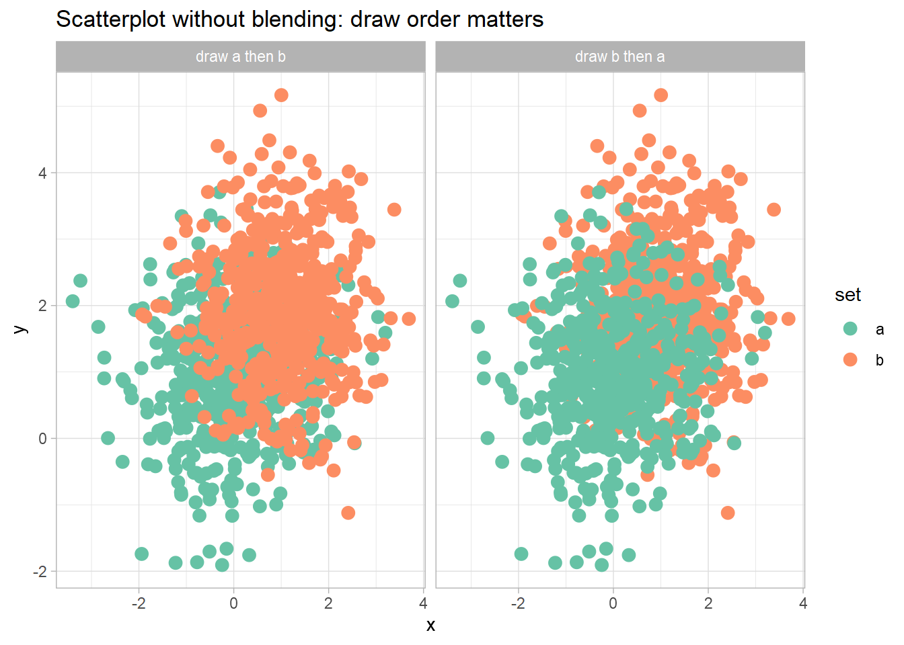
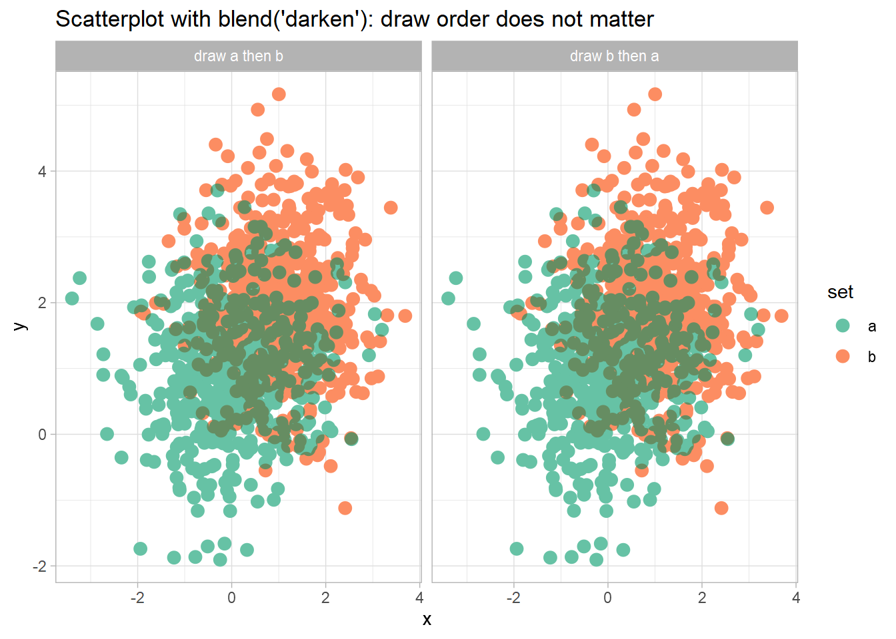
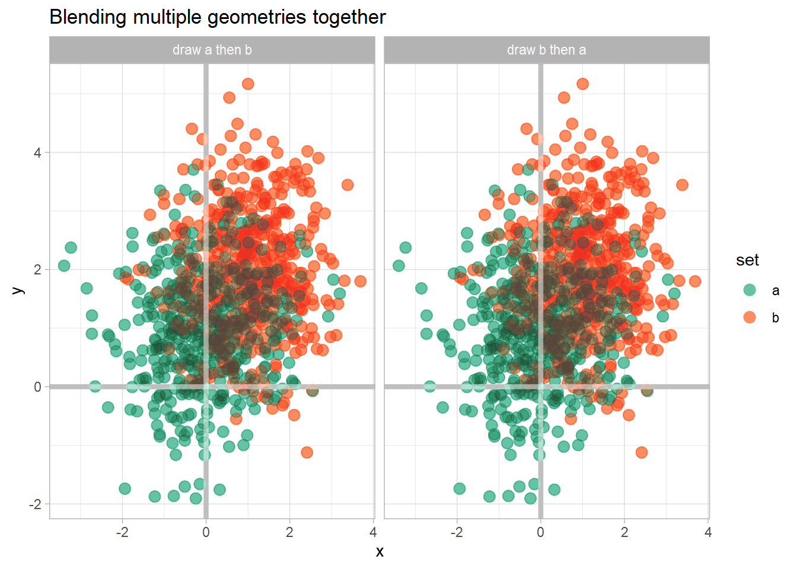
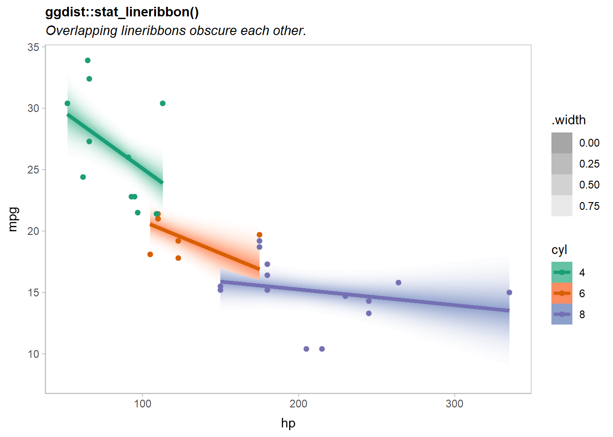
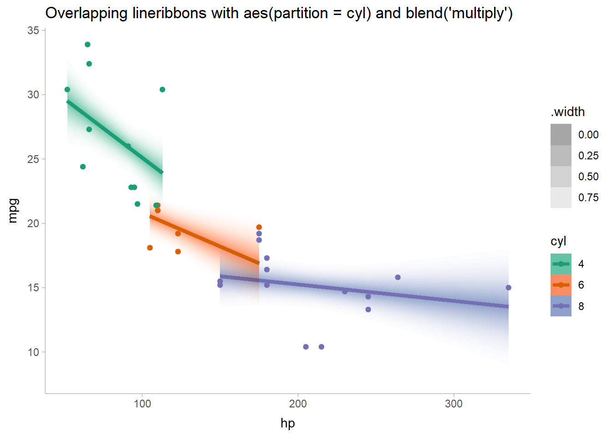

# ggblend

<!-- badges: start -->

[](https://lifecycle.r-lib.org/articles/stages.html#experimental)
[](https://CRAN.R-project.org/package=ggblend)
[](https://app.codecov.io/gh/mjskay/ggblend?branch=main)
[](https://github.com/mjskay/ggblend/actions)
<!-- badges: end -->

*ggblend* adds support for blend modes (like `"multiply"`, `"overlay"`,
etc) to *ggplot2*. It requires R \>= 4.2, as blending and compositing
support was added in that version of R.

## Installation

You can install the development version of *ggblend* using:

``` r
remotes::install_github("mjskay/ggblend")
```

## Blending within one geometry

We’ll construct a simple dataset with two semi-overlapping point clouds.
We’ll have two versions of the dataset: one with all the `"a"` points
listed first, and one with all the `"b"` points listed first.

``` r
library(ggplot2)
library(ggblend)
theme_set(theme_light())

set.seed(1234)
df_a = data.frame(x = rnorm(500, 0), y = rnorm(500, 1), set = "a")
df_b = data.frame(x = rnorm(500, 1), y = rnorm(500, 2), set = "b")

df_ab = rbind(df_a, df_b) |>
  transform(order = "draw a then b")

df_ba = rbind(df_b, df_a) |>
  transform(order = "draw b then a")

df = rbind(df_ab, df_ba)
```

A typical scatterplot of such data suffers from the problem that how
many points appear to be in each group depends on the drawing order (*a
then b* versus *b then a*):

``` r
df |>
  ggplot(aes(x, y, color = set)) +
  geom_point(size = 3) +
  scale_color_brewer(palette = "Set2") +
  facet_grid(~ order) +
  ggtitle("Scatterplot without blending: draw order matters")
```

<!-- -->

A *commutative* blend mode, like `"multiply"` or `"darken"`, is one
potential solution that does not depend on drawing order. We can wrap
`geom_point()` in a call to `blend()` to achieve this, using something
like `blend(geom_point(...), "darken")` or equivalently
`geom_point(...) |> blend("darken")`:

``` r
df |>
  ggplot(aes(x, y, color = set)) +
  geom_point(size = 3) |> blend("darken") +
  scale_color_brewer(palette = "Set2") +
  facet_grid(~ order) +
  ggtitle("Scatterplot with blend('darken'): draw order does not matter")
```

<!-- -->

Now the output is identical no matter the draw order.

## Blending multiple geometries

We can also blend geometries together by passing a list of geometries to
`blend()`. These lists can include already-blended geometries:

``` r
df |>
  ggplot(aes(x, y, color = set)) +
  list(
    geom_point(size = 3) |> blend("darken"),
    geom_vline(xintercept = 0, color = "gray75", size = 1.5),
    geom_hline(yintercept = 0, color = "gray75", size = 1.5)
  ) |> blend("hard.light") +
  scale_color_brewer(palette = "Set2") +
  facet_grid(~ order) +
  labs(title = "Blending multiple geometries together")
```

<!-- -->

## Blending groups within one geometry

Sometimes it’s useful to have finer-grained control of blending within a
given geometry. Here, we’ll show how to use `blend()` with
`stat_lineribbon()` from [ggdist](https://mjskay.github.io/ggdist/) to
create overlapping gradient ribbons depicting uncertainty.

We’ll fit a model:

``` r
m_mpg = lm(mpg ~ hp * cyl, data = mtcars)
```

And generate some confidence distributions for the mean using
[distributional](https://pkg.mitchelloharawild.com/distributional/):

``` r
grid = unique(mtcars[ c("cyl", "hp")])

predictions = grid |>
  cbind(predict(m_mpg, newdata = grid, se.fit = TRUE)) |>
  transform(mu_hat = distributional::dist_student_t(df = df, mu = fit, sigma = se.fit))

predictions
```

    ##                     cyl  hp      fit    se.fit df residual.scale
    ## Mazda RX4             6 110 20.28825 0.7984429 28       2.973694
    ## Datsun 710            4  93 25.74371 0.8818612 28       2.973694
    ## Hornet Sportabout     8 175 15.56144 0.8638133 28       2.973694
    ## Valiant               6 105 20.54952 0.8045354 28       2.973694
    ## Duster 360            8 245 14.66678 0.9773475 28       2.973694
    ## Merc 240D             4  62 28.58736 1.2184598 28       2.973694
    ## Merc 230              4  95 25.56025 0.9024699 28       2.973694
    ## Merc 280              6 123 19.60892 0.8423540 28       2.973694
    ## Merc 450SE            8 180 15.49754 0.8332276 28       2.973694
    ## Cadillac Fleetwood    8 205 15.17801 0.7674501 28       2.973694
    ## Lincoln Continental   8 215 15.05021 0.7866649 28       2.973694
    ## Chrysler Imperial     8 230 14.85849 0.8606705 28       2.973694
    ## Fiat 128              4  66 28.22044 1.1218796 28       2.973694
    ## Honda Civic           4  52 29.50466 1.4914670 28       2.973694
    ## Toyota Corolla        4  65 28.31217 1.1451536 28       2.973694
    ## Toyota Corona         4  97 25.37679 0.9280143 28       2.973694
    ## Dodge Challenger      8 150 15.88096 1.0770037 28       2.973694
    ## Porsche 914-2         4  91 25.92718 0.8665404 28       2.973694
    ## Lotus Europa          4 113 23.90910 1.2628426 28       2.973694
    ## Ford Pantera L        8 264 14.42394 1.1660619 28       2.973694
    ## Ferrari Dino          6 175 16.89163 1.5508852 28       2.973694
    ## Maserati Bora         8 335 13.51650 2.0458075 28       2.973694
    ## Volvo 142E            4 109 24.27603 1.1625257 28       2.973694
    ##                                         mu_hat
    ## Mazda RX4           t(28, 20.28825, 0.7984429)
    ## Datsun 710          t(28, 25.74371, 0.8818612)
    ## Hornet Sportabout   t(28, 15.56144, 0.8638133)
    ## Valiant             t(28, 20.54952, 0.8045354)
    ## Duster 360          t(28, 14.66678, 0.9773475)
    ## Merc 240D             t(28, 28.58736, 1.21846)
    ## Merc 230            t(28, 25.56025, 0.9024699)
    ## Merc 280             t(28, 19.60892, 0.842354)
    ## Merc 450SE          t(28, 15.49754, 0.8332276)
    ## Cadillac Fleetwood  t(28, 15.17801, 0.7674501)
    ## Lincoln Continental t(28, 15.05021, 0.7866649)
    ## Chrysler Imperial   t(28, 14.85849, 0.8606705)
    ## Fiat 128              t(28, 28.22044, 1.12188)
    ## Honda Civic          t(28, 29.50466, 1.491467)
    ## Toyota Corolla       t(28, 28.31217, 1.145154)
    ## Toyota Corona       t(28, 25.37679, 0.9280143)
    ## Dodge Challenger     t(28, 15.88096, 1.077004)
    ## Porsche 914-2       t(28, 25.92718, 0.8665404)
    ## Lotus Europa          t(28, 23.9091, 1.262843)
    ## Ford Pantera L       t(28, 14.42394, 1.166062)
    ## Ferrari Dino         t(28, 16.89163, 1.550885)
    ## Maserati Bora         t(28, 13.5165, 2.045807)
    ## Volvo 142E           t(28, 24.27603, 1.162526)

A basic plot based on examples in
`vignette("freq-uncertainty-vis", package = "ggdist")` and
`vignette("lineribbon", package = "ggdist")` may have issues when
lineribbons overlap:

``` r
predictions |>
  ggplot(aes(x = hp, fill = ordered(cyl), color = ordered(cyl))) +
  ggdist::stat_lineribbon(
    aes(ydist = mu_hat, fill_ramp = stat(.width)),
    .width = ppoints(40)
  ) +
  geom_point(aes(y = mpg), data = mtcars) +
  scale_fill_brewer(palette = "Set2") +
  scale_color_brewer(palette = "Dark2") +
  ggdist::scale_fill_ramp_continuous(range = c(1, 0)) +
  labs(
    title = "Overlapping lineribbons without blending", 
    color = "cyl", fill = "cyl", y = "mpg"
  ) +
  ggdist::theme_ggdist()
```

<!-- -->

Notice the overlap of the orange (`cyl = 6`) and purple (`cyl = 8`)
lines.

If we add a `blend_group = cyl` aesthetic mapping, we can blend the
geometries for the different levels of `cyl` together with a `blend()`
call around `ggdist::stat_lineribbon()`:

``` r
predictions |>
  ggplot(aes(x = hp, fill = ordered(cyl), color = ordered(cyl), blend_group = cyl)) +
  ggdist::stat_lineribbon(
    aes(ydist = mu_hat, fill_ramp = stat(.width)),
    .width = ppoints(40)
  ) |> blend("multiply") +
  geom_point(aes(y = mpg), data = mtcars) +
  scale_fill_brewer(palette = "Set2") +
  scale_color_brewer(palette = "Dark2") +
  ggdist::scale_fill_ramp_continuous(range = c(1, 0)) +
  labs(
    title = "Overlapping lineribbons with blend('multiply')", 
    color = "cyl", fill = "cyl", y = "mpg"
  ) +
  ggdist::theme_ggdist()
```

<!-- -->

Now the overlapping ribbons are blended together.
